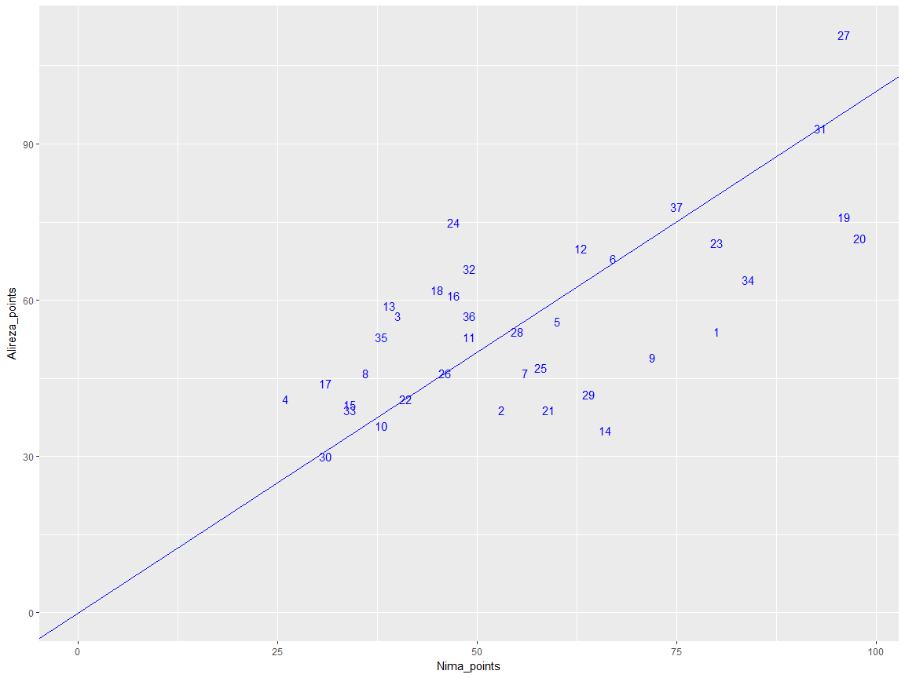
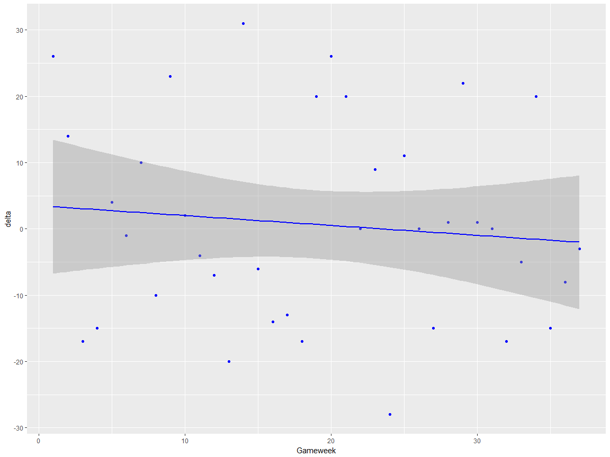
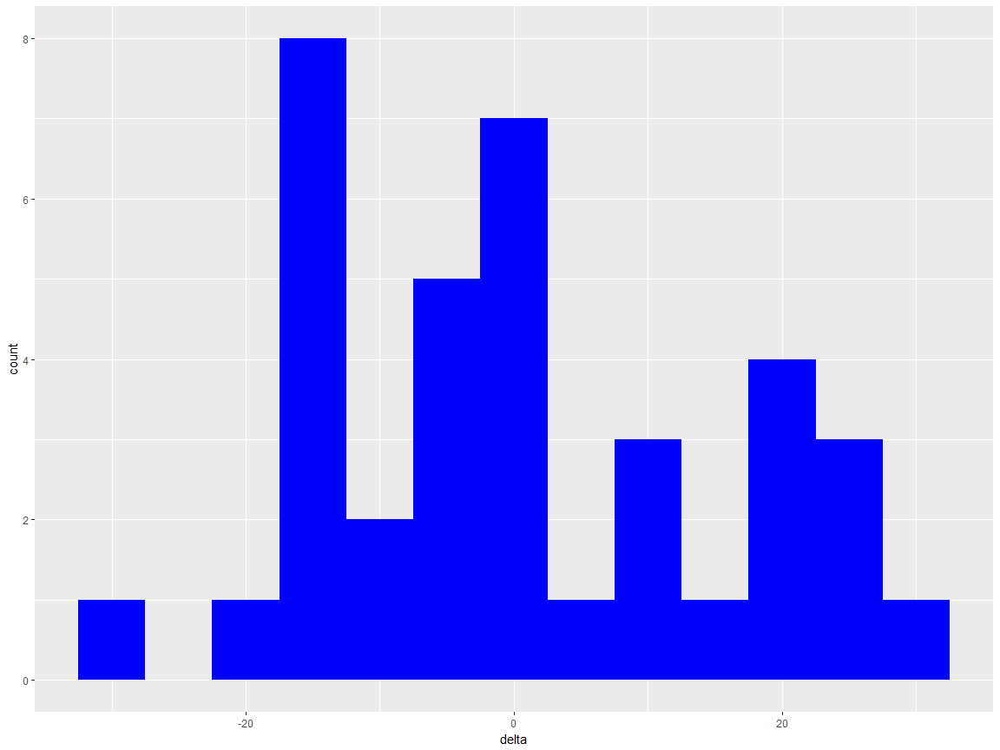
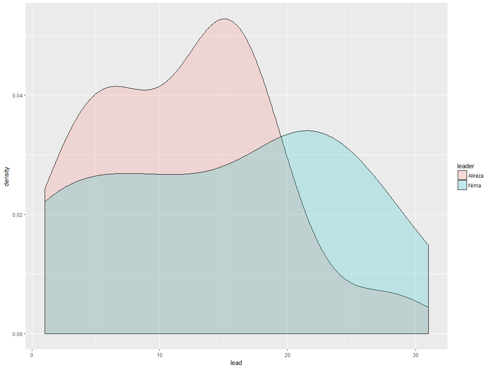
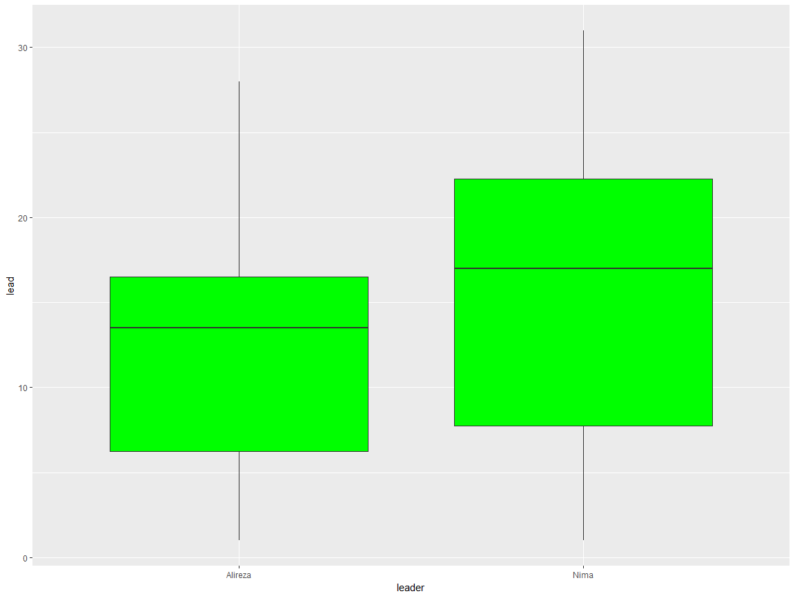
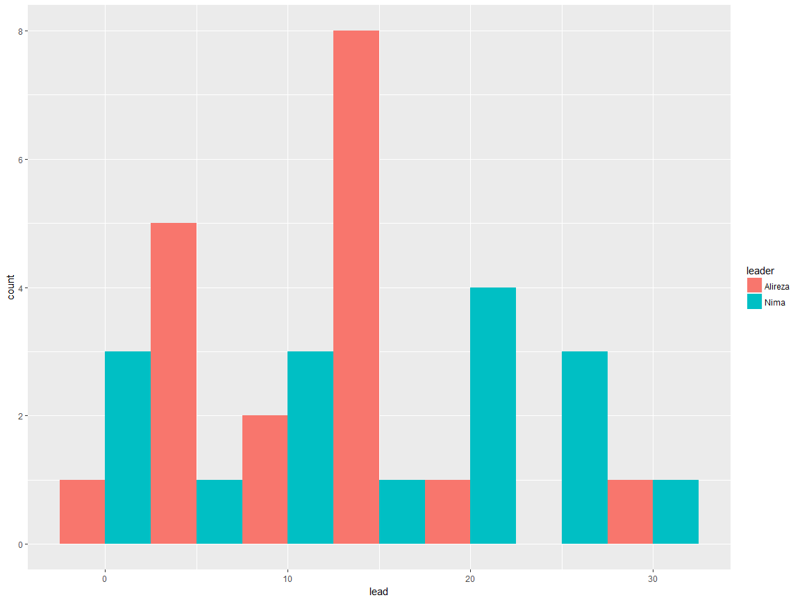
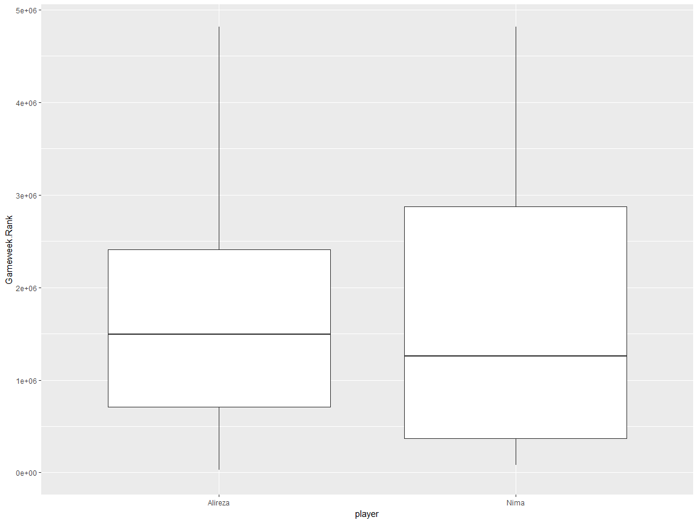
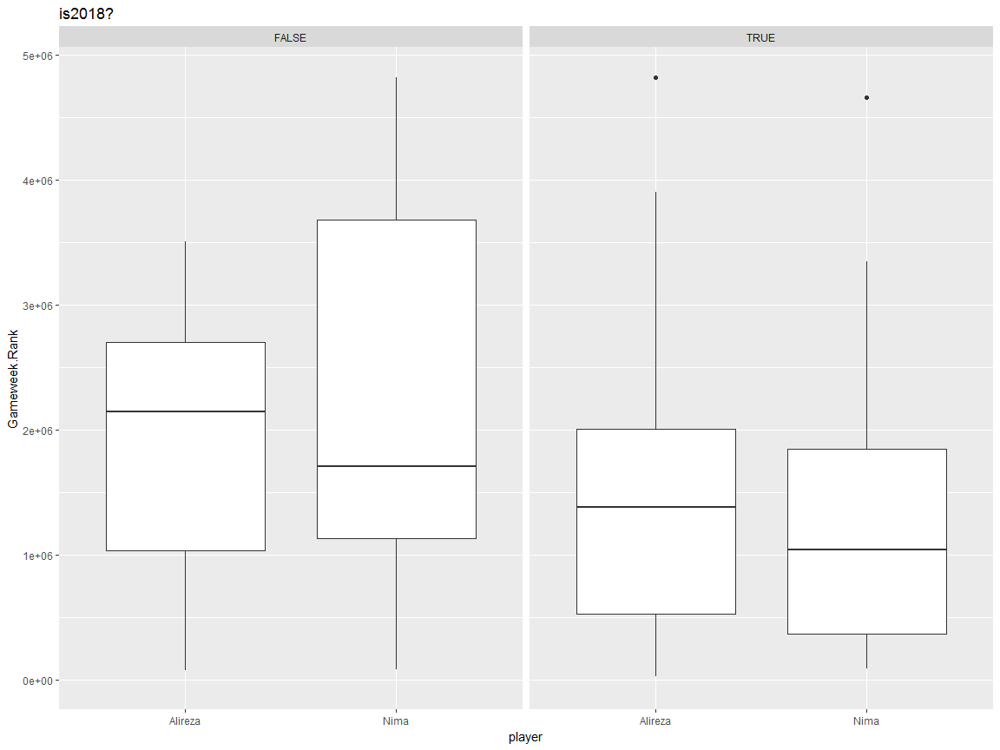

```r
# Libraries
library(ggplot2)
library(dplyr)
```

```
## 
## Attaching package: 'dplyr'
```

```
## The following objects are masked from 'package:stats':
## 
##     filter, lag
```

```
## The following objects are masked from 'package:base':
## 
##     intersect, setdiff, setequal, union
```

```r
# Read and Clean
Nima <- read.csv("Nima.csv")
Alireza <- read.csv("Alireza.csv")
Nima$Nima_points <- Nima$Points - Nima$Transfers.Cost
Alireza$Alireza_points <- Alireza$Points - Alireza$Transfers.Cost
Nima$player <- "Nima"
Alireza$player <- "Alireza"
DF <- merge(Nima, Alireza, by = "Gameweek")
DF$delta <- DF$Nima_points - DF$Alireza_points
DF$lead <- abs(DF$delta)
DF$leader <- "none"
DF[DF$delta > 0,]$leader <- "Nima"
DF[DF$delta < 0,]$leader <- "Alireza"
DF2 <- rbind(
    Alireza[, c("Gameweek", "player", "Gameweek.Rank")],
    Nima[, c("Gameweek", "player", "Gameweek.Rank")])
DF2$is2018 <- (DF2$Gameweek > 19)

## graphs
ggplot(DF, aes(x = Nima_points, y = Alireza_points, label = Gameweek)) + 
    geom_text(colour = "blue") +
    geom_abline(slope = 1, intercept = 0, colour = "blue") +
    expand_limits(x = 0, y = 0)
```

<!-- -->

```r
ggplot(DF, aes(x = Gameweek, y = delta)) + 
    geom_point(colour = "blue") + 
    geom_smooth(colour = "blue", method = lm)
```

<!-- -->

```r
ggplot(DF, aes(x = delta)) + 
    geom_histogram(fill = "blue", binwidth = 5)
```

<!-- -->

```r
ggplot(subset(DF, delta != 0), aes(x = lead, fill = leader)) + 
    geom_density(alpha = 0.2)
```

<!-- -->

```r
table(DF$leader)
```

```
## 
## Alireza    Nima    none 
##      18      16       3
```

```r
ggplot(subset(DF, delta != 0), aes(x = leader, y = lead)) + 
    geom_boxplot(fill = "green")
```

<!-- -->

```r
ggplot(subset(DF, delta != 0), aes(x = lead, fill = leader)) + 
    geom_histogram(position = "dodge", binwidth = 5)
```

<!-- -->

```r
ggplot(subset(DF, delta != 0), aes(x = leader, y = lead)) + 
    geom_boxplot(fill = "green")
```

<!-- -->

```r
ggplot(DF2, aes(x = player, y = Gameweek.Rank)) + 
    geom_boxplot() +
    expand_limits(y = 0)
```

<!-- -->

```r
ggplot(DF2, aes(x = player, y = Gameweek.Rank)) + 
    geom_boxplot() + 
    facet_grid(. ~ is2018) + 
    ggtitle("is2018?") +
    expand_limits(y = 0)
```

<!-- -->

